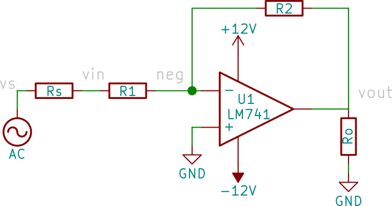
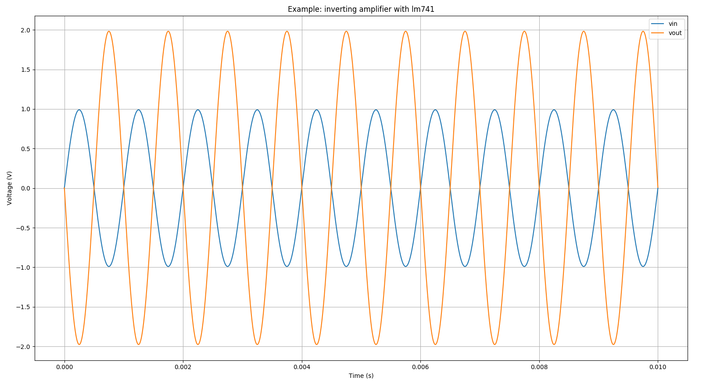

# Spice Raw Parser (spr)

A tiny Python package to parse spice raw data files.

## Getting Started

These instructions will get you a copy of the package up and running on your local machine.

**Note: at the moment only ascii raw spice format is supported!**

### Installation

#### From PyPI
```
pip install spr
```

#### From source code

```
pip install git+https://github.com/goncalo-godwitlabs/spr.git
```

or

```
git clone git@github.com:goncalo-godwitlabs/spr.git
cd spr/
make install
```

### Usage

Just run:

```
from spr import load_raw
data = load_raw("/path/to/rawspice.raw")
```

### Data structure

A properly parsed raw spice file by `load_raw()` returns a dictionary with the following structure:

```
{
    "title": <str>,
    "date:": <str>,
    "plotname:": <str>,
    "flags:": <str>,
    "no_vars:": <str>,
    "no_points:": <str>,
    "vars": [
        { "idx": <int>, "name": <str>, "type": <str> },
        { "idx": <int>, "name": <str>, "type": <str> }
        ...
        { "idx": <int>, "name": <str>, "type": <str> }
    ]
    "values": {
        "var1": <numpy.ndarray>,
        "var2": <numpy.ndarray>,
        ...
        "varN": <numpy.ndarray>
    }
}
```

Where values `values` is a numpy structured array with the actual data.

## Examples

The following examples make use of ngspice to run the spice simulations, so please ensure it is installed.
On ubuntu that would be:
```
sudo apt install ngspice
```

### Inverting amplifier with an opamp LM741

Check the directory `examples/amplifier/` for details on the cirtcuit and the simulation files.

The schematic:



Run the simulation with:

```
git clone git@github.com:goncalo-godwitlabs/spr.git
cd spr
make run-example-amplifier
```

which will fire ngspice generating output.log and rawspice.raw files and also plots the voltages `vin` and `vout`.




## License

This project is licensed under the MIT License - see the [LICENSE.md](LICENSE.md) file for details
