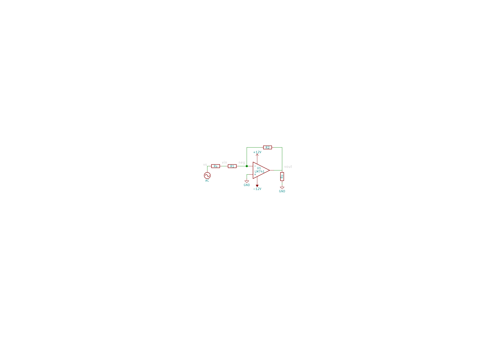
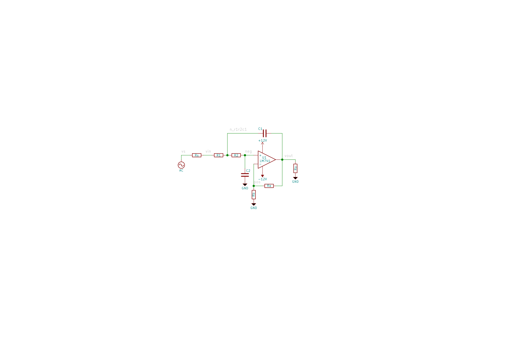
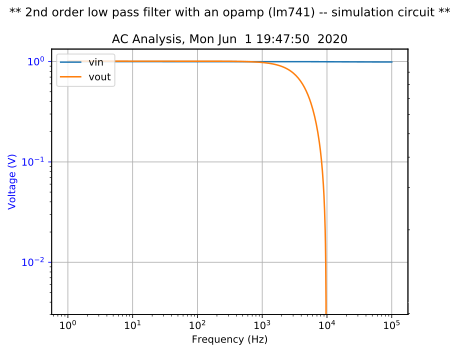

=====
Spyci
=====

A tiny Python package to parse and plot spice raw data files.

.. image:: https://img.shields.io/pypi/v/spyci.svg
    :target: https://pypi.python.org/pypi/spyci

.. image:: https://img.shields.io/travis/gmagno/spyci.svg
    :target: https://travis-ci.com/gmagno/spyci

.. image:: https://readthedocs.org/projects/spyci/badge/?version=latest
    :target: https://spyci.readthedocs.io/en/latest/?badge=latest
    :alt: Documentation Status

* Free software: MIT license
* Documentation: https://spyci.readthedocs.io.

Getting Started
---------------

These instructions will get you a copy of the package up and running on your local machine.

**Note: at the moment only ascii raw spice format is supported!**

Installation
------------

From PyPI
^^^^^^^^^

::

    $ pip install spyci  # it is recommended to this in a virtual environment

From the github repo
^^^^^^^^^^^^^^^^^^^^

::

    $ pip install git+https://github.com/gmagno/spyci.git

or

::

    $ git clone git@github.com:gmagno/spyci.git
    $ cd spyci/
    $ python setup.py install

Usage
^^^^^

From python run::

    >>> from spyci import spyci
    >>> data = spyci.load_raw("/path/to/rawspice.raw")  # see 'Data structure' section below

Or just use the CLI::

    $ spyci -r /path/to/rawspice.raw vin vout

for more details use::

    $ spyci -h
    usage: spyci [-h] [-v] [-r RAW_FILE] [-l] [-f] [-o OUT_IMAGE] ...
    
    Spyci (spyci v0.6.1) -- parses ngspice raw data files and
    plots the specified variables.
    For full documentation check the repo: https://github.com/gmagno/spyci
    
    positional arguments:
      VARS                  List of variables to plot
    
    optional arguments:
      -h, --help            show this help message and exit
      -v, --version         shows spyci version
      -r RAW_FILE, --raw-file RAW_FILE
                            path to raw file to be parsed
      -l, --list-variables  lists variables that can be plotted
      -f, --out-formats     lists supported output image formats
      -o OUT_IMAGE, --out-image OUT_IMAGE
                            path to output image file, use -f, to list supported
                            formats
    
                                                     /##
                                                    |__/
              /#######  /######  /##   /##  /####### /##
             /##_____/ /##__  ##| ##  | ## /##_____/| ##
            |  ###### | ##  \ ##| ##  | ##| ##      | ##
             \____  ##| ##  | ##| ##  | ##| ##      | ##
             /#######/| #######/|  #######|  #######| ##
            |_______/ | ##____/  \____  ## \_______/|__/
                      | ##       /##  | ##
                      | ##      |  ######/
                      |__/       \______/
    
    return:
        The return value of spyci is 0 if the raw file is successfully
        parsed and plotted.
    
    examples:
        # Run without arguments will attempt to load rawspice.raw from cwd
        # and plot all variables
        $ spyci
    
        # List variables that can be plotted
        $ spyci -l
        Variables:
    
        idx  name        type
        -----  ----------  -------
            1  i(l1)       current
            2  n1          voltage
            3  vi          voltage
            4  vo          voltage
            5  i(vsource)  current
    
        # Load 'some/location/sim.raw' and plot variables 'i(l1)' and 'vo'
        $ spyci -r some/location/sim.raw "i(l1)" vo
    
        # Indices can be used insted of variable names, this is equivalent
        # to the previous example
        $ spyci -r some/location/sim.raw 1 4
    
        # Save your plot to the file system
        $ spyci -o myplot.png 1 4
    
        # Different image formats are supported, just use the correct
        # extension, {.png, .svg, .pdf, ...}. For a list of supported
        # formats run with -f flag
        $ spyci -f
        Supported output image file formats:
    
        ext    format
        -----  -------------------------
        raw    Raw RGBA bitmap
        rgba   Raw RGBA bitmap
        pgf    PGF code for LaTeX
        svgz   Scalable Vector Graphics
        svg    Scalable Vector Graphics
        ps     Postscript
        png    Portable Network Graphics
        eps    Encapsulated Postscript
        pdf    Portable Document Format
    
    copyright:
        Copyright © 2020 Gonçalo Magno <goncalo@gmagno.dev>
        This software is licensed under the MIT License.

Data structure
^^^^^^^^^^^^^^

A properly parsed raw spice file by `load_raw()` returns a dictionary with the following structure::

    {
        "title": <str>,
        "date:": <str>,
        "plotname:": <str>,
        "flags:": <str>,
        "no_vars:": <str>,
        "no_points:": <str>,
        "vars": [
            { "idx": <int>, "name": <str>, "type": <str> },
            { "idx": <int>, "name": <str>, "type": <str> }
            ...
            { "idx": <int>, "name": <str>, "type": <str> }
        ]
        "values": {
            "var1": <numpy.ndarray>,
            "var2": <numpy.ndarray>,
            ...
            "varN": <numpy.ndarray>
        }
    }

Where values `values` is a numpy structured array with the actual data.

Examples
^^^^^^^^

The following examples make use of ngspice to run the spice simulations, so please ensure it is installed.
On ubuntu that would be::

    $ sudo apt install ngspice

Inverting amplifier with an opamp LM741
^^^^^^^^^^^^^^^^^^^^^^^^^^^^^^^^^^^^^^^

Check the directory `examples/amplifier/` for details on the cirtcuit and the simulation files.

The schematic:

Run the simulation with::

    $ cd examples/amplifier
    $ ngspice -r rawspice.raw -o output.log main.cir
    $ spyci vout vin

which will fire ngspice generating output.log and rawspice.raw files and also plots the voltages `vin` and `vout`.

.. image:: examples/amplifier/plot.svg
    :width: 630px
    :align: center
    :height: 496px
    :alt: amplifier

Second order low pass filter with an opamp LM741
^^^^^^^^^^^^^^^^^^^^^^^^^^^^^^^^^^^^^^^^^^^^^^^^

Check the directory `examples/lp_filter/` for details on the cirtcuit and the simulation files.

The schematic:

Run the simulation with::

    $ cd examples/lp_filter
    $ ngspice -r rawspice.raw -o output.log main.cir
    $ spyci vout vin

which will fire ngspice generating output.log and rawspice.raw files and also plots the gain `vout`/`vin` in dB.

License
^^^^^^^

This project is licensed under the MIT License - see the `LICENSE <https://github.com/gmagno/spyci/blob/master/LICENSE>`_ file for details
